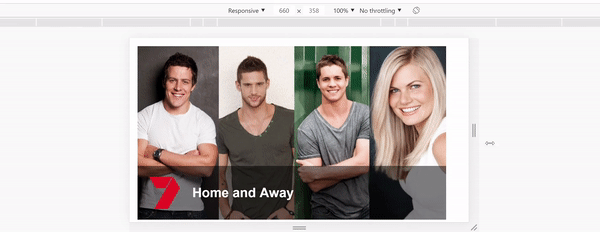

# Responsive Card
Responsive card with image and overlay with title and logo.

### 1. Technology stack:

- react
- styled-components

### 2. Requirements:

- Node.js v10.15.1

### 3. Instructions:

1. Clone repository in your machine
2. Run 'npm install' to install dependencies
3. Run 'npm start' to start the project
4. Run 'npm test' to run unit tests